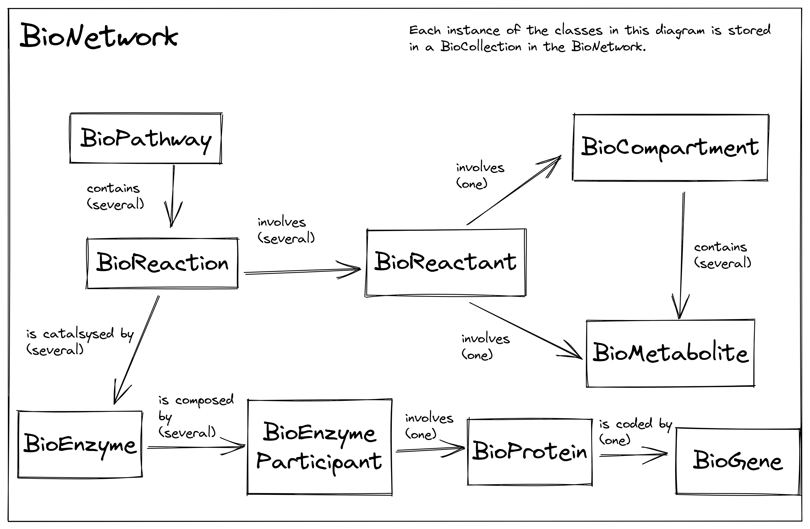
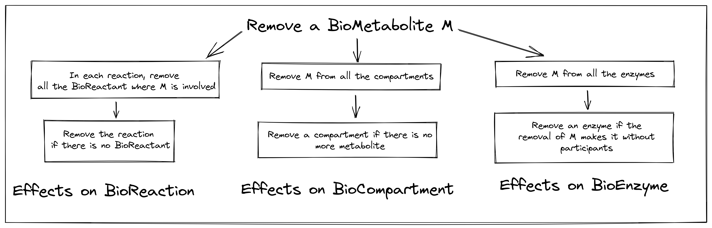
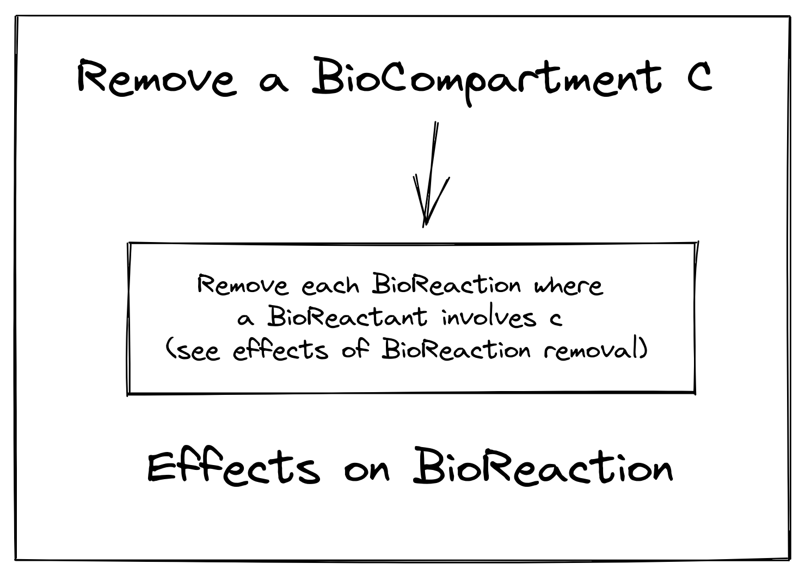
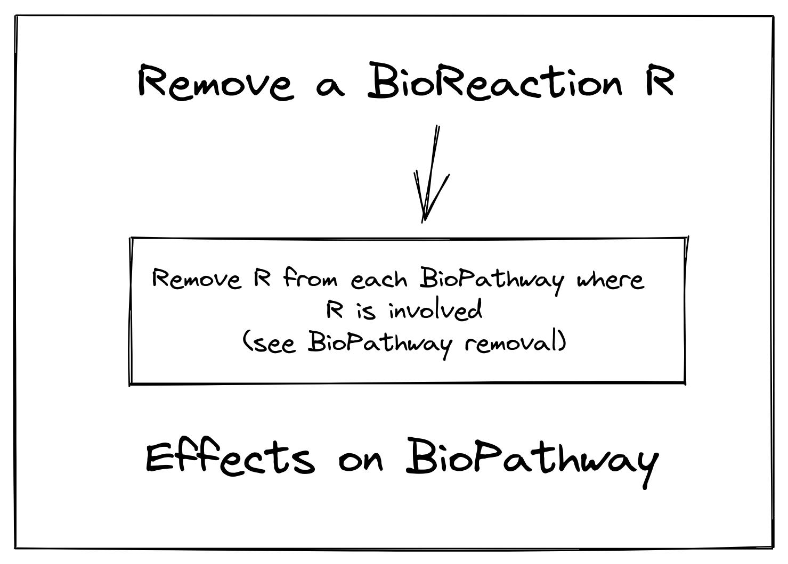
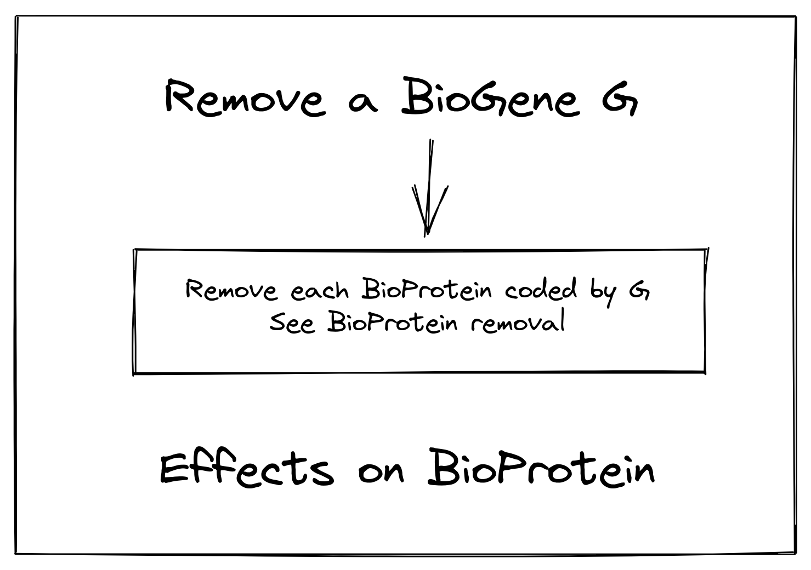
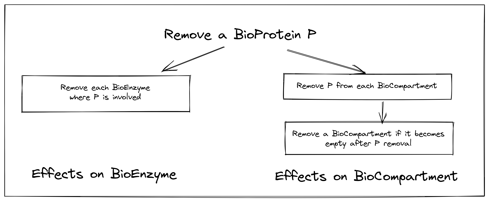
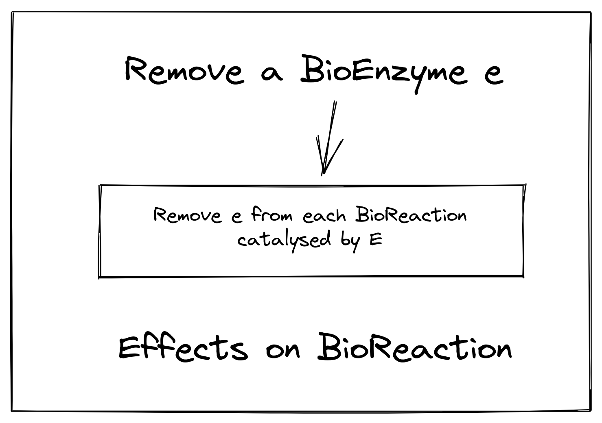

# met4j-core

## Met4j module for basic manipulation of metabolic networks

### Installation

```console
cd met4j-core;
mvn clean install;
```

### Using met4j-core in a maven project

Put this in the pom.xml file of your project:

```xml
<dependencies>
...
 <dependency>
  <groupId>fr.inrae.toulouse.metexplore</groupId>
   <artifactId>met4j-core</artifactId>
    <version>0.12.0</version>
 </dependency>
...
</dependencies>
```

Change the version number if needed.

### Documentation

Examples can be found here :
<https://forgemia.inra.fr/metexplore/tutorialmet4j/blob/master/src/main/java/fr/inrae/toulouse/metexplore/tutorialmet4j/met4j_core>

#### The BioEntity class

All the classes describing biological entities inherit from the BioEntity class.  Each BioEntity has these fields:

- id (String). The main field of a BioEntity is its id. This id is final, i.e. it can not be changed after the creation of the BioEntity. This ensures the consistency of the maps containing BioEntity, especially BioCollection instances. If during the construction of a BioEntity, the id is null or empty, a unique random id will be set. The id must not contain spaces.
- name (String)
- synonyms (Array of String)
- comment (String)
- A map of references (BioRef)
- A map of attributes (Object)

#### The BioCollection class

The collections of biological entities are handled by the BioCollection class.
The most important rule of a BioCollection is that we can not add an entity if an entity with the same id already exists in the BioCollection.

#### The BioNetwork class

The BioNetwork class is the essential class of met4j.

It contains and links all the entities composing a metabolic network (metabolites, reactions,
pathways, genes, proteins, enzymes, compartments).


_BioNetwork content_

All the links between biological entities are handled by methods in the BioNetwork class.

##### Creation of a BioNetwork

From scratch:

```java
BioNetwork network = new BioNetwork("myBioNetwork");
```

Read the [met4j-io documentation](../met4j-io/README.md) to see how create a BioNetwork from SBML, TSV or KEGG.

#### The BioMetabolite class

The BioMetabolite class has these additional fields:

- molecularWeight (Double)
- chemicalFormula (String)
- charge (int)
- inchi (String) : [International Chemical Identifier](https://www.inchi-trust.org/)
- smiles (string) : [Simplified molecular-input line-entry system](https://en.wikipedia.org/wiki/Simplified_molecular-input_line-entry_system)


##### Creation of a BioMetabolite

```java
BioMetabolite m = new BioMetabolite("m", "myMetabolite");
```

##### Add a BioMetabolite in a BioNetwork

```java
network.add(m);
```

##### Remove a BioMetabolite from a BioNetwork

```java
network.removeOnCascade(m);
```

Removing a metabolite causes the removal of other entities linked to it in the network.


_Cascade of removals after removing a BioMetabolite from a BioNetwork_

#### The BioCompartment class

A BioCompartment contains a BioCollection of BioEntity (most often BioMetabolite). This list is private, the only way to add BioEntity in a BioCompartment is to use BioNetwork methods.

##### Creation of a BioCompartment

```java
BioCompartment c = new BioCompartment("c", "cytosol");
```

##### Add a BioCompartment in a BioNetwork

Only empty compartments can be added to a BioNetwork.

```java
network.add(c);
```

##### Add a BioMetabolite in a BioCompartment

```java
network.affectToCompartment(c, m);
```

##### Add several BioMetabolite in a BioCompartment

```java
network.affectToCompartment(c, m1, m2, m3);
```

or

```java
BioCollection<BioMetabolite> metabolites = new BioCollection<>;
metabolites.add(m1, m2, m3);
network.affectToCompartment(c, metabolites);
```

##### Remove a BioMetabolite from a BioCompartment

```java
network.removeOnCascade(c);
```

Removing a BioCompartment causes the removal of other entities linked to it in the network.



_Cascade of removals after removing a BioCompartment from a BioNetwork_


#### The BioReaction class

The BioReaction has these additional parameters:

- spontaneous (Boolean)
- ecNumber (String) :[Enzyme Commission Number](https://en.wikipedia.org/wiki/Enzyme_Commission_number)
- reversible (Boolean)
- left : a BioCollection of BioReactant
- right : a BioCollection of BioReactant
- enzymes : a BioCollection of BioEnzyme

##### Create a BioReaction

```java
BioReaction r = new BioReaction("r", "myReaction");
```

##### Add a BioReaction in a BioNetwork 

Only reactions without left nor right reactants nor enzymes  can be added to a BioNetwork.

```java
network.add(r);
```

##### Add a reactant in a BioReaction

A reactant is a triplet BioMetabolite-stoichiometry-BioCompartment.
The BioCompartment and the BioMetabolite must be present in the BioNetwork and the BioMetabolite must be present in the BioCompartment.

```java
network.affectLeft(r, 1.0, c, m1);
network.affectRight(r, 2.0, c, m2);
```

##### Add several reactants in a BioReaction

It's possible to add several reactants in a BioReaction if they are in the same compartment and they have the same stroichiometry.

```java
network.affectLeft(r, 1.0, c, m1, m2, m3);
```

##### Remove a BioReaction from a BioNetwork

```java
network.removeOnCascade(r);
```
Removing a BioReaction causes the removal of other entities linked to it in the network.



_Cascade of removals after removing a BioReaction from a BioNetwork_


#### The BioGene class

##### Create a BioGene

```java
BioGene g = new BioGene("g");
```

##### Add a BioGene in a BioNetwork

```java
network.add(g);
```

##### Remove a BioGene from a BioNetwork

```java
network.removeOnCascade(g);
```

Removing a BioGene causes the removal of other entities linked to it in the network.



_Cascade of removals after removing a BioGene from a BioNetwork_


#### The BioProtein class

A BioProtein has only one additional parameter: a BioGene. Indeed, in met4j, a BioProtein corresponds to only one BioGene but a BioGene can code for different BioProtein (e.g. splicing event).

##### Create a BioProtein

```java
BioProtein p = new BioProtein("p", "myProtein");
```

##### Add a BioProtein in a BioNetwork

The protein must not be linked to a BioGene to be added to a BioNetwork.

```java
network.add(p);
```

##### Affect a BioGene to a BioProtein

Both BioProtein and BioGene must be present in the BioNetwork.

```java
network.affectGeneProduct(p, g);
```

##### Remove a BioProtein from a BioNetwork

```java
network.removeOnCascade(p);
```

Removing a BioProtein causes the removal of other entities linked to it in the network.



_Cascade of removals after removing a BioProtein from a BioNetwork_


#### The BioEnzyme class

A BioEnzyme can be composed by several BioEnzymeParticipant which are a pair of a BioProtein (or a BioMetabolite) and a stroichiometry.

##### Create a BioEnzyme

```java
BioEnzyme e = new BioEnzyme("e", "myEnzyme");
```

##### Add a BioEnzyme to a BioNetwork

The BioEnzyme must not contain BioEnzymeParticipant.

```java
network.add(e);
```

##### Add a BioProtein (or a BioMetabolite) to a BioNetwork

Both BioEnzyme and BioProtein must be present in the BioNetwork.

```java
network.affectSubUnit(e, 1.0, p);
```

##### Add several BioProtein (or BioMetabolite) to a BioNetwork

```java
network.affectSubUnit(e, 1.0, p, m);
```

##### Affect an enzyme to a reaction 

Both BioEnzyme and BioReaction must be present in the BioNetwork.

```java
network.affectEnzyme(r, e);
```

##### Affect several enzymes to a reaction 

```java
network.affectEnzyme(r, e1, e2);
```

or

```java
BioCollection<BioEnzyme> enzymes = new BioCollection<>();
enzymes.add(e1, e2)
network.affectEnzyme(r, enzymes);
```


##### Remove a BioEnzyme from a BioNetwork

```java
network.removeOnCascade(e);
```

Removing a BioEnzyme causes the removal of other entities linked to it in the network.



_Cascade of removals after removing a BioEnzyme from a BioNetwork_


#### The BioPathway class

A BioPathway contains several BioReaction.

##### Creation of a BioPathway

```java
BioPathway p = new BioPathway("p", "myProtein");
```

##### Add a BioReaction in a BioPathway

```java
network.affectToPathway(p, r);
```

##### Add several BioReaction in a BioPathway

```java
network.affectToPathway(p, r1, r2, r3);
```

or

```java
BioCollection<BioReaction> reactions = new BioCollection<>();
network.affectToPathway(p, reactions);
```

##### Remove a BioPathway from a BioNetwork

```java
network.removeOnCascade(p);
```